# Travel Multi-Agent Analytics Guide

This guide walks you through generating realistic data in the Travel Multi-Agent application, then using Microsoft Fabric to analyze multi-agent memory patterns, trip planning behavior, and user preferences.

## What You'll Build

- **Web Application** — The complete Travel Assistant deployed to Azure Container Apps, featuring an Angular frontend where users chat with specialized AI agents that plan personalized trips. The agents remember user preferences, search for hotels, restaurants, and activities, and build day-by-day itineraries — all powered by Azure Cosmos DB and Azure OpenAI. See the [User Guide](../02_completed/USER_GUIDE.md) for a full walkthrough of the application's features.
- **Data Generator** — A Python script that simulates 12 diverse users having realistic conversations with the travel assistant, generating memories, trips, and conversation data in Cosmos DB.
- **Spark Notebook** — A Fabric notebook that reads mirrored Cosmos DB data, flattens nested JSON structures, and writes 10 analytical Delta tables to OneLake.
- **SQL Queries** — Ready-to-run queries for the Fabric SQL Analytics Endpoint for quick ad-hoc exploration.
- **Power BI Report** — A 5-page report visualizing memory intelligence, user preferences, trip patterns, destination insights, and memory health.

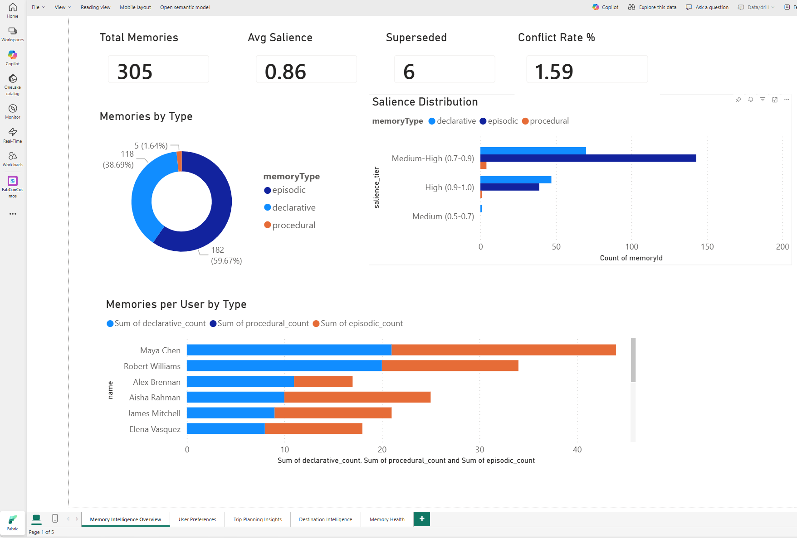

## Prerequisites

- The Travel Multi-Agent application deployed and running ([see main README](../README.md))
- Azure Cosmos DB with the application's containers populated
- Microsoft Fabric workspace with:
  - Cosmos DB Mirroring configured for: **Memories**, **Users**, **Trips**, **Places**
  - A Lakehouse for analytical tables

> **Using the deployed solution:** If you deployed the complete solution to Azure Container Apps via `azd up`, the data generator can target the deployed API directly — no local servers required. Use the `--base-url` flag with your API endpoint (see Step 1.5).

---

## Step 1: Generate Data

The application ships with only a handful of seed users and trips. The data generator creates realistic conversation data by simulating 12 user personas interacting with the travel assistant.

### 1.1 Set Up the Analytics Virtual Environment

```powershell
cd analytics
python -m venv .venv
.venv\Scripts\Activate.ps1      # Windows
# source .venv/bin/activate     # macOS/Linux
pip install httpx
```

### 1.2 Install Application Requirements

Before starting the servers, create the application's virtual environment and install its dependencies:

```powershell
cd 02_completed
python -m venv venv
venv\Scripts\Activate.ps1       # Windows
# source venv/bin/activate      # macOS/Linux
pip install -r requirements.txt
```

> **Note:** If you already completed this step as part of the main workshop setup, you can skip it.

### 1.3 Start the Application

You need two services running before the data generator can work. Open separate terminals for each:

**Option A — Use the deployed API (recommended if you ran `azd up`):**

No local servers needed. Get your API endpoint:

```powershell
cd 02_completed
azd env get-value API_URI
```

Use this URL with the `--base-url` flag when running the data generator (see Step 1.5).

> **Note:** The deployed API endpoint is internal to the Container Apps Environment, so you need to use the frontend's `/api` proxy instead. Get the frontend URL with `azd env get-value FRONTEND_URI` and use `--base-url <FRONTEND_URI>/api`.

**Option B — Run locally:**

**Terminal 1 — MCP Tool Server** (start first):

```powershell
cd 02_completed\mcp_server
..\venv\Scripts\Activate.ps1
$env:PYTHONPATH="..\python"
python mcp_http_server.py
```

Wait for `Travel Assistant MCP server initialized`.

**Terminal 2 — API Server**:

```powershell
cd 02_completed\python
..\venv\Scripts\Activate.ps1
uvicorn src.app.travel_agents_api:app --reload --host 0.0.0.0 --port 8000
```

Wait for `✅ Agents initialized successfully!`

> **Note:** The Angular frontend (port 4200) is **not required** for data generation. The data generator talks directly to the API server.

### 1.4 Run a Dry Run

Preview what the generator will do without making any API calls:

```powershell
cd analytics
.venv\Scripts\Activate.ps1
python data_generator.py --dry-run --personas 2
```

This shows the user personas, their conversations, and all messages that will be sent.

### 1.5 Generate Data

Start with a small run to verify everything works:

```powershell
python data_generator.py --personas 2
```

If targeting the deployed API instead of localhost:

```powershell
python data_generator.py --personas 2 --base-url https://<your-frontend-url>/api
```

Once confirmed, generate the full dataset (12 personas, ~30 conversations, ~80 messages):

```powershell
python data_generator.py
```

To speed things up significantly, run multiple personas in parallel:

```powershell
python data_generator.py --parallel 4
```

This runs 4 personas concurrently, cutting wall-clock time by ~4x (from 2+ hours to ~30-40 minutes). Each persona uses its own HTTP client and independent user/session, so there are no conflicts. The main constraint is your Azure OpenAI TPM — with `--parallel 4`, you'll want at least **200K TPM** on the completion model to avoid heavy 429 throttling.

> **Note:** The data generator takes about **3 hours** to complete. It simulates real users having conversations one message at a time, and the multi-agent system takes 30-90 seconds to process each message (searching places, extracting memories, creating itineraries). You can safely leave it running and come back later -- progress is logged to the console in real time.
>
> **While waiting**, jump ahead to **Step 2** (set up Cosmos DB mirroring) and **Step 3.1–3.4** (create the Lakehouse, upload the notebook, attach data sources, and configure the connection string). These steps don't require the generated data to be complete. When the data generator finishes and the mirrored data syncs, you'll be ready to run the notebook immediately.

> **Azure OpenAI TPM Requirements:** Each user message triggers 7-8 LLM calls internally (orchestrator routing, preference extraction, conflict resolution, specialist agent, place search). For the full 292-message run, the system consumes approximately **10M tokens** on the completion model. Recommended TPM settings:
>
> | Model Deployment | Recommended TPM | Notes |
> |-----------------|----------------|-------|
> | **Completion model (e.g. gpt-4o)** | **150K TPM** | 100K minimum but expect occasional 429 throttling. 150K gives headroom for itinerary-heavy sequences. |
> | **Embedding model (e.g. text-embedding-3-small)** | **10K TPM** | Actual peak usage is ~2K TPM. The default deployment minimum is sufficient. |
>
> If you hit rate limit errors (429s), increase `--delay` to space out messages (e.g., `--delay 5` or `--delay 10`).

**Command-line options:**

| Flag | Default | Description |
|------|---------|-------------|
| `--base-url` | `http://localhost:8000` | Travel API base URL |
| `--tenant` | `analytics_demo` | Tenant ID for generated data |
| `--personas` | all 12 | Limit to first N personas |
| `--delay` | `3` | Seconds between messages |
| `--timeout` | `180` | HTTP timeout per request (seconds) |
| `--parallel` | `1` | Run N personas concurrently (3-4 recommended) |
| `--dry-run` | off | Print plan without calling API |

### 1.6 What Gets Generated

The 12 personas cover diverse traveler archetypes:

| Persona | Style | Key Preferences | Destinations |
|---------|-------|-----------------|--------------|
| Maya Chen | Budget backpacker | Vegan, peanut allergy, hostel | Bangkok, Tokyo |
| James Mitchell | Luxury couple | Fine dining, 5-star, romantic | Paris, Rome |
| Sarah Johnson | Family with kids | Gluten-free, wheelchair access, kid-friendly | London, Barcelona |
| David Okafor | Business traveler | Halal, executive hotels, nightlife | Singapore, Dubai, Frankfurt |
| Elena Vasquez | Adventure solo | Vegetarian, eco-lodges, hiking | New Zealand, Iceland |
| Robert Williams | Retired couple | Low-sodium, senior-friendly, classical | Barcelona, Lisbon, Vienna |
| Jordan Taylor | College group | Budget, nightlife, cheap eats | Miami, Amsterdam |
| Priya Sharma | Food tourism | All cuisines, food tours, cooking classes | Tokyo, Istanbul, Copenhagen |
| Alex Brennan | Digital nomad | Pescatarian→vegetarian, wifi priority | Lisbon, Bali |
| Isabelle Dupont | Art & culture | Flexitarian, galleries, design hotels | Amsterdam, Berlin |
| Aisha Rahman | Wellness seeker | Halal, yoga, spa, organic | Bali, Stockholm |
| Marco Rossi | History & architecture | Traditional cuisine, historic hotels | Prague, Istanbul, Budapest |

Each persona has 2-3 conversations that generate:

- **Memories** -- dietary restrictions, budget preferences, accessibility needs, style preferences (declarative, procedural, episodic types)
- **Trips** -- day-by-day itineraries with hotel, restaurant, and activity recommendations
- **Memory conflicts** -- e.g., Maya updates from "vegan" to "pescatarian", Alex goes from "pescatarian" to "vegetarian"
- **Trip status mix** -- after all conversations, the generator automatically updates some trips to "confirmed" and "completed" status

### 1.7 Enrich with Preference Conflicts (Optional)

After running the data generator, you can optionally run the enricher to add **more preference conflicts** for richer analytics. The enricher sends short conversations where users contradict their earlier preferences, triggering memory supersession in the AI system.

```powershell
python data_enricher.py --dry-run    # Preview
python data_enricher.py              # Run
```

The enricher adds conflicts for 6 users not already covered by the generator:

| User | Conflict | Original Preference |
|------|----------|-------------------|
| Sarah Johnson | No longer gluten-free, no wheelchair needed, wants luxury | Was gluten-free, wheelchair access, budget |
| David Okafor | Plant-based diet, prefers co-working, early mornings | Was halal, executive lounges, nightlife |
| Elena Vasquez | Now omnivore, prefers luxury, wants guided tours | Was vegetarian, eco-lodges, solo hiking |
| Jordan Taylor | Wants nice hotel, cultural experiences, local cuisine | Was cheapest hotel, nightlife, fast food |
| Alex Brennan | Eating meat again, no wifi priority, chain hotels | Was vegetarian, wifi-first, boutique |
| Isabelle Dupont | Now fully vegan, street art, budget accommodation | Was flexitarian, galleries, design hotels |

These conflicts create **superseded memories** that show up in the Memory Health page of the Power BI report, demonstrating the AI's ability to handle changing preferences.

**Command-line options:**

| Flag | Default | Description |
|------|---------|-------------|
| `--base-url` | `http://localhost:8000` | Travel API base URL |
| `--tenant` | `analytics_demo` | Tenant ID for generated data |
| `--delay` | `3` | Seconds between messages |
| `--timeout` | `300` | HTTP timeout per request (seconds) |
| `--dry-run` | off | Print plan without calling API |

---

## Step 2: Mirror Data to Fabric

Cosmos DB Mirroring replicates your operational data into Fabric as Delta tables, making it available for Spark notebooks, SQL queries, and Power BI — without any ETL pipelines.

### 2.1 Configure RBAC for Mirroring

Before setting up mirroring, your Cosmos DB account needs a custom RBAC role that grants Fabric the `readMetadata` and `readAnalytics` data actions. Scripts are included for both PowerShell (Windows) and Bash (macOS/Linux) to create this role and assign it to your signed-in user.

1. Gather the following values from your Cosmos DB account in the Azure portal (found on the **Overview** page):
   - **Subscription ID**
   - **Resource Group name**
   - **Cosmos DB account name**

2. Authenticate and run the script for your platform:

**Windows (PowerShell):**

```powershell
# Authenticate with Azure PowerShell
Connect-AzAccount

# Run the RBAC script
cd analytics
.\rbac-mirror.ps1
```

> Requires the `Az` PowerShell modules (`Az.Accounts`, `Az.Resources`, `Az.CosmosDB`). Install with `Install-Module -Name Az -Scope CurrentUser` if needed.

**macOS / Linux (Bash):**

```bash
# Authenticate with Azure CLI
az login

# Run the RBAC script
cd analytics
chmod +x rbac-mirror.sh
./rbac-mirror.sh
```

3. Both scripts will prompt you for the three values above, then:
   - Create a custom Cosmos DB SQL role definition (`Custom-CosmosDB-Metadata-Analytics-Reader`) with `readMetadata` and `readAnalytics` permissions
   - Assign the role to your currently signed-in user
   - Skip creation if the role or assignment already exists (idempotent)

   The script will ask whether to export the role definition JSON to a local file — this is optional and you can safely answer **no**.

### 2.2 Create a Mirrored Database

1. Open your Fabric workspace in the [Fabric portal](https://app.fabric.microsoft.com).
2. Click **+ New item**.
3. Under **Connect to external data**, select **Mirrored Azure Cosmos DB**.
4. Name the mirrored database **TravelAssistantDatabase** and click **Create**.

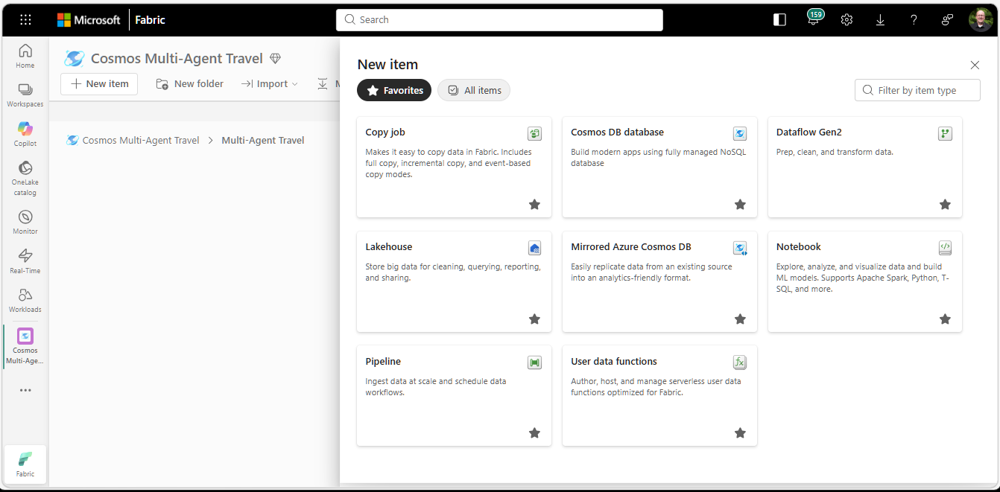

### 2.3 Select the Connection Source

1. On the connection source screen, select **Azure Cosmos DB v2**.
2. Click **Next**.

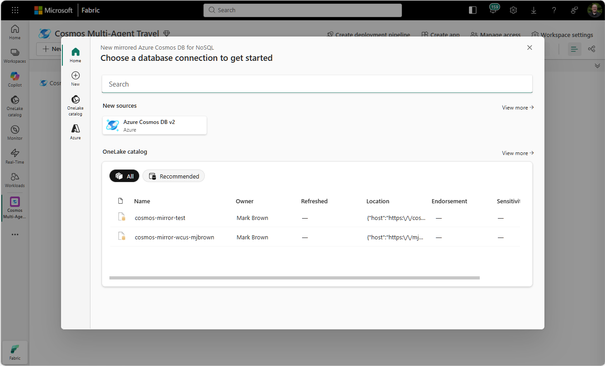

### 2.4 Connect to Your Cosmos DB Account

1. On the **New connection** screen, enter your Cosmos DB account URL (e.g., `https://<your-account>.documents.azure.com:443/`). You can find this on the **Overview** page of your Cosmos DB account in the Azure portal.
2. For **Authentication kind**, select **Organizational account**.
3. Click **Sign in** and authenticate with your Azure AD credentials.
4. Click **Connect**.

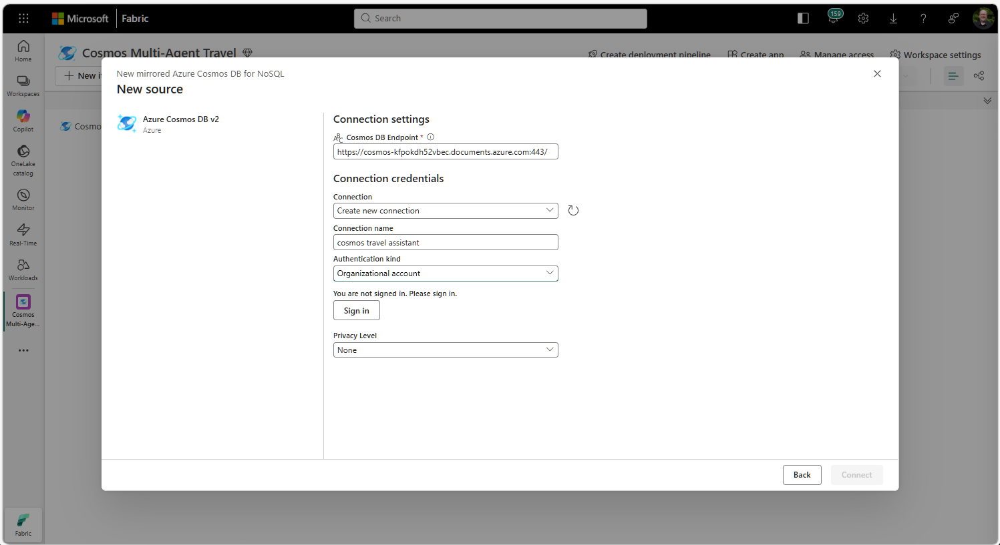

### 2.5 Select the Database

1. After connecting, Fabric displays the databases in your Cosmos DB account.
2. Select **TravelAssistant** (the database created by the Bicep deployment).
3. Click **Connect**.

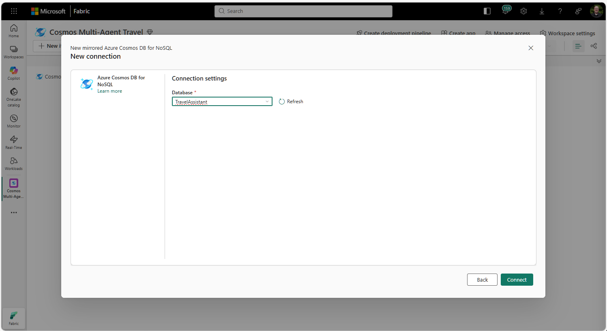

### 2.6 Select Containers to Mirror

1. Fabric shows all containers in the TravelAssistant database.
2. Select these four containers:
   - **Memories**
   - **Users**
   - **Trips**
   - **Places**
3. Leave the remaining containers (Sessions, Messages, Summaries, ApiEvents, Checkpoints, Debug) unchecked — they are not needed for analytics.
4. Click **Connect**.

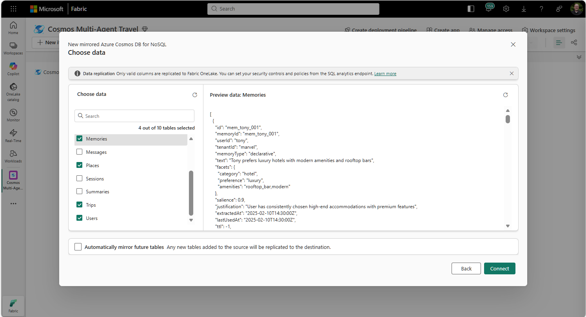

### 2.7 Name the Mirrored Database

1. Fabric prompts you to name the destination mirror artifact.
2. Enter **TravelAssistantDatabase** as the name.
3. Click **Mirror**.

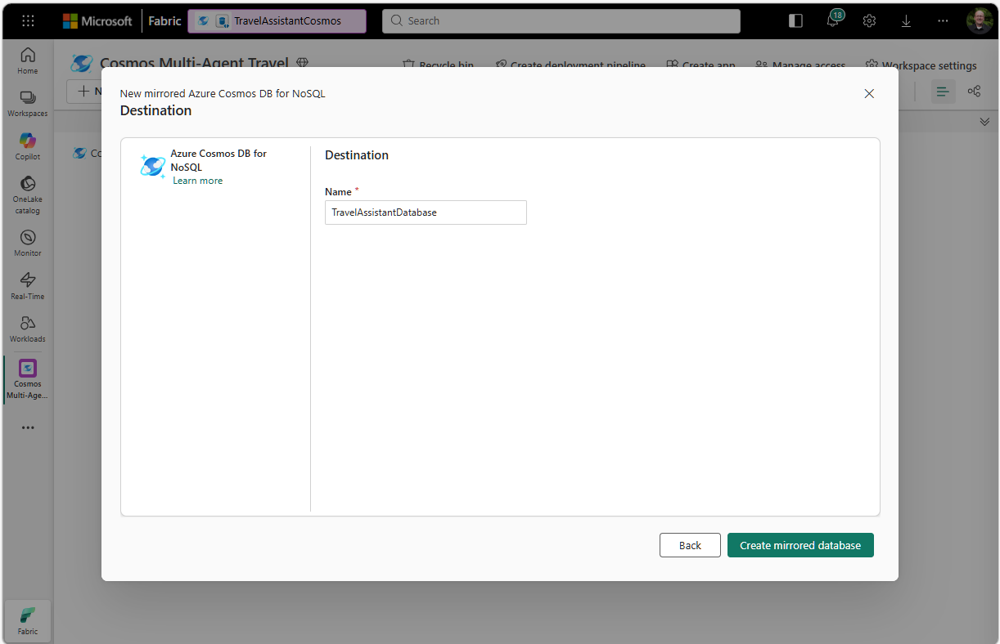

### 2.8 Verify Mirroring Status

1. Fabric begins the initial replication. You'll see a status page showing each container's sync progress.
2. Wait for all four containers to show **Running** with a green checkmark. The initial sync typically takes 2-5 minutes depending on data volume.
3. The schema inside the mirrored database will automatically be named **TravelAssistant**, matching the Cosmos DB database name.

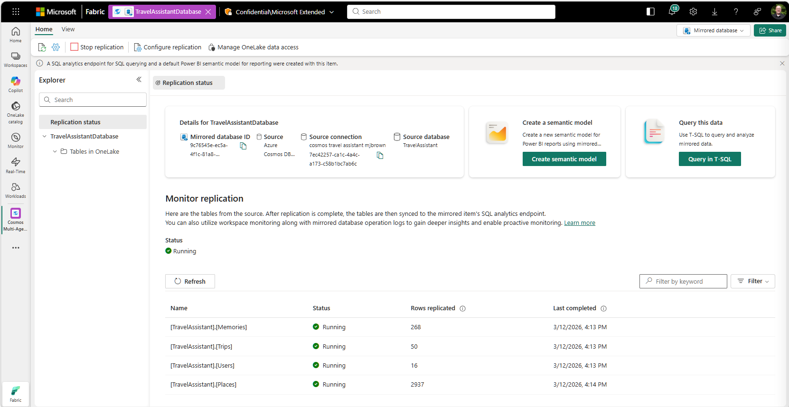

> **Note:** Once mirroring is running, changes in Cosmos DB are replicated continuously (near real-time). If you're still running the data generator, you'll see row counts increase as new data arrives.

The mirrored data appears as Delta tables accessible via both Spark and the SQL Analytics Endpoint.

---

## Step 3: Run the Spark Notebook

The notebook (`TravelAssistantNotebook.ipynb`) reads from the mirrored database and writes analytical tables to a Lakehouse.

### 3.1 Upload to Fabric

1. In your Fabric workspace, create a **Lakehouse** named **TravelAssistantLakehouse**. During creation, check **Lakehouse schemas** (required for mirrored database access).
1. Return to your Fabric workspace.
1. Click **Import**, then **Notebook** and upload `analytics/TravelAssistantNotebook.ipynb`.
1. Open the notebook in the Fabric portal.

### 3.2 Attach Data Sources

Before running the notebook, you need to attach both the Lakehouse and the mirrored database:

1. **Attach the Lakehouse**: In the notebook's left sidebar (Explorer), click **Add data items**, select **From OneLake catalog** and select **TravelAssistantLakehouse**.
2. **Attach the Mirrored Database**: Click **Add data items** > select **From OneLake catalog** > select **TravelAssistantDatabase** (your mirrored database).
3. Expand the mirrored database. You should see the **TravelAssistant** schema with the four tables (Memories, Users, Trips, Places) in the Explorer sidebar.

> **Important:** The notebook reads data via `pyodbc` (not through the Explorer attachments), but attaching the mirrored database confirms it is accessible from your notebook environment.

### 3.3 How It Reads Data

The notebook connects directly to the mirrored database's **SQL Analytics Endpoint** using `pyodbc` with AAD token authentication. This bypasses Spark's catalog entirely (which cannot resolve mirrored databases) and reads data via standard SQL queries into pandas DataFrames, then converts to Spark.

You need the SQL connection string from the Fabric portal:

1. Open your mirrored database in the Fabric portal.
2. Go to **Settings** (the gear icon).
3. Copy the **SQL endpoint** (it looks like `xxxxx.datawarehouse.fabric.microsoft.com`).

### 3.4 Configure

Update these values in the first code cell:

```python
WORKSPACE_NAME = "YourWorkspaceName"
MIRRORED_DB = "TravelAssistantDatabase"
MIRRORED_SCHEMA = "TravelAssistant"
SQL_ENDPOINT = "xxxxx.datawarehouse.fabric.microsoft.com"  # from Fabric portal
```

> **Note:** `MIRRORED_DB` is the name you gave the mirrored database artifact in Fabric (e.g., `TravelAssistantDatabase`). `MIRRORED_SCHEMA` is the Cosmos DB database name, which is automatically set to `TravelAssistant` by the Bicep deployment. If you followed the naming above, these values do not need to change -- only `WORKSPACE_NAME` and `SQL_ENDPOINT` require updating.

### 3.5 Run All Cells

1. Start a new standard Spark session in your notebook.
1. Click Run all. Allow the notebook to complete executing.
1. You can scroll down as the notebook executes to ensure it completes.
1. Expand the TravelAssistantLakehouse in the Explorer pane to view the new tables in your lakehouse. You may need to refresh the lakehouse in the Explorer pane.

The notebook produces these tables in your Lakehouse:

| Layer | Table | Description |
|-------|-------|-------------|
| Silver | `silver_memories_flat` | Memories with facets extracted as columns |
| Silver | `silver_trips_days` | Trips exploded to one row per day |
| Silver | `silver_trip_activities` | One row per activity slot (morning/lunch/afternoon/dinner/accommodation) |
| Gold | `gold_user_memory_profile` | Per-user KPIs: memory counts, avg salience, conflict rate |
| Gold | `gold_memory_salience_analysis` | Per-memory detail: health, lifespan, recall tracking |
| Gold | `gold_destination_popularity` | Trip counts, duration, travelers per destination |
| Gold | `gold_place_inventory` | Hotels/restaurants/activities per city |
| Gold | `gold_popular_places` | Most recommended places across all trips |
| Gold | `gold_memory_trip_alignment` | Do stored preferences match actual trip recommendations? |
| Gold | `gold_memory_lifecycle` | Supersession rates, recall rates, short-term vs. long-term health |

---

## Step 4: Power BI Report

The report visualizes how the multi-agent system learns about users, plans trips, and uses memory to personalize recommendations. It has 5 pages that tell a story about the AI's memory and decision-making patterns.

### Understanding Memory Types

The multi-agent system stores three types of memories, each serving a different purpose:

| Type | What It Stores | TTL | Examples |
|------|---------------|-----|----------|
| **Declarative** | Permanent facts about the user | None (permanent) | "User is vegan", "Allergic to peanuts", "Requires wheelchair access" |
| **Procedural** | Behavioral patterns and habits | None (permanent) | "Always eats dinner late around 9pm", "Prefers walking over taxis", "Always books private tours instead of group tours" |
| **Episodic** | Trip-specific preferences | 90 days | "Wants to try paella in Barcelona", "Interested in Gaudi architecture for this trip" |

- **Declarative memories** are the foundation -- they capture hard facts like dietary restrictions, allergies, and accessibility needs. These are always applied when searching for places.
- **Procedural memories** capture *how* users behave, not just *what* they like. They influence scheduling (late dinners), style (boutique vs chain hotels), and pace (relaxed vs packed itineraries).
- **Episodic memories** are temporary and trip-specific. They expire after 90 days, reflecting that "wants to visit the Louvre" is relevant now but not forever.

The report's Memory Intelligence page shows the distribution across all three types, and the Memory Health page tracks which memories are actively being used vs. going stale.

### Option A: Build from Scratch (Recommended)

Build the report manually in Power BI Desktop. See [`PowerBI_Build_Guide.md`](PowerBI_Build_Guide.md) for detailed step-by-step instructions including exact visual types, table names, column assignments, and descriptions of what each visual tells you. This is the recommended approach as it gives you full control over the report layout and ensures compatibility with your data.

### Option B: Use the Pre-built Template

> **Note:** The `.pbit` template and `.pbix` file included in this repository are **untested** and may not work correctly with your Lakehouse schema. If you encounter issues loading or refreshing the template, use **Option A** above to build the report from scratch using the [`PowerBI_Build_Guide.md`](PowerBI_Build_Guide.md).

A Power BI template is included in this repository:

1. Download `TravelAssistantReport.pbit` from the `analytics/` folder.
2. Open it in **Power BI Desktop**. It will prompt you for the `LakehouseSQLEndpoint` parameter.
3. Enter your Lakehouse's **SQL Analytics Endpoint** URL.
   - You can find this URL in the Fabric portal: open your Lakehouse > click the **SQL Analytics Endpoint** dropdown > copy the connection string.

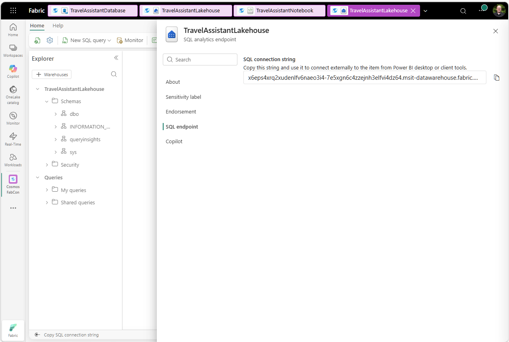

4. Click **Load**. The report connects to your Lakehouse and loads your data.
5. Publish to your Fabric workspace if desired.

Summary of the steps:

1. Open **Power BI Desktop** and use **Get Data** → **SQL Server database** with your Lakehouse SQL Analytics Endpoint URL.
2. Select **Import** mode and load the `gold_*` and `silver_trip_activities` tables.
3. Build the 5 pages described below.

---

### Page 1: Memory Intelligence Overview

This page answers: **How much has the AI learned about its users?**

This is the executive summary of the AI's memory system. KPI cards show total memories, number of users, average salience (confidence), and active memory count. A donut chart breaks memories down by type (declarative, procedural, episodic), while a clustered bar chart shows the salience distribution colored by memory type. The per-user bar chart reveals which users the system knows best and the composition of that knowledge.

**Key insights to highlight:**

- Declarative memories (permanent facts like "vegan" or "allergic to peanuts") vs. episodic memories (trip-specific, 90-day TTL)
- High-salience memories indicate strong, clearly stated preferences
- Users with balanced memory types across all three categories have the richest profiles


---

### Page 2: Memory Health

This page answers: **How healthy is the AI's memory system?**

This page digs into the durability and lifecycle of the AI's knowledge. A stacked bar chart shows each user's memory lifespan breakdown (permanent vs. 90-day episodic), and a pie chart shows the system-wide split. The active vs. superseded bar chart reveals which users change their minds most — users with large superseded segments had preference conflicts the AI detected and resolved. A memory health by type chart shows whether declarative, procedural, or episodic memories tend to be healthier.

**Key insights to highlight:**

- Memory supersession demonstrates the AI's ability to handle conflicting information (e.g., "I'm vegan" followed by "I actually eat seafood now")
- The balance between long-term permanent memories and short-term episodic memories shows how established each user's profile is
- Declarative memories should be mostly active or superseded since they don't expire, while episodic memories are more likely to age

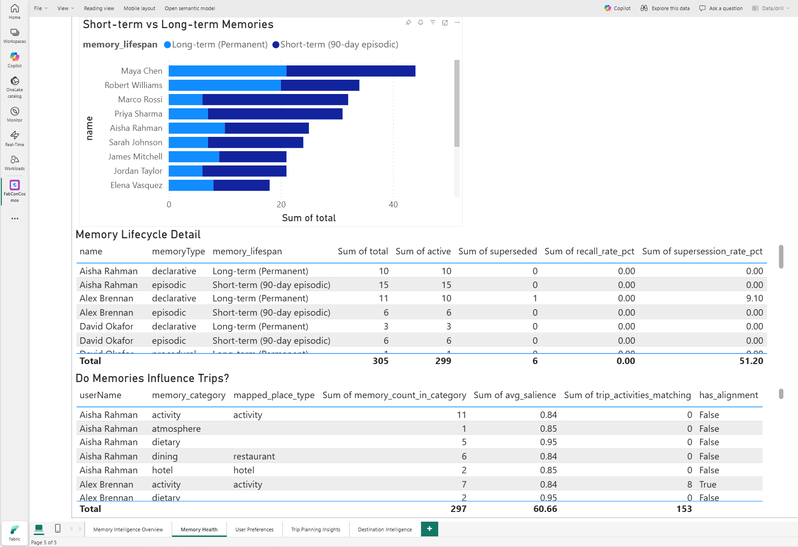

---

### Page 3: User Preferences

This page answers: **What does the AI know about each user's preferences?**

This page explores the preference categories the AI has extracted from conversations — dietary needs, hotel style, activity types, budget, accessibility, and more. A donut chart shows the distribution across categories. Two stacked bar charts break each category down by memory type (declarative/procedural/episodic) and by memory health (active/aging/stale/superseded), revealing which preference areas are most durable.

**Key insights to highlight:**

- The distribution reveals which areas the AI captures most — dining and hotel preferences tend to dominate because users state them explicitly
- Categories with high supersession rates (like dietary) reflect users who changed their preferences over time
- Categories dominated by episodic memories are trip-specific and temporary, while declarative-heavy categories represent lasting knowledge

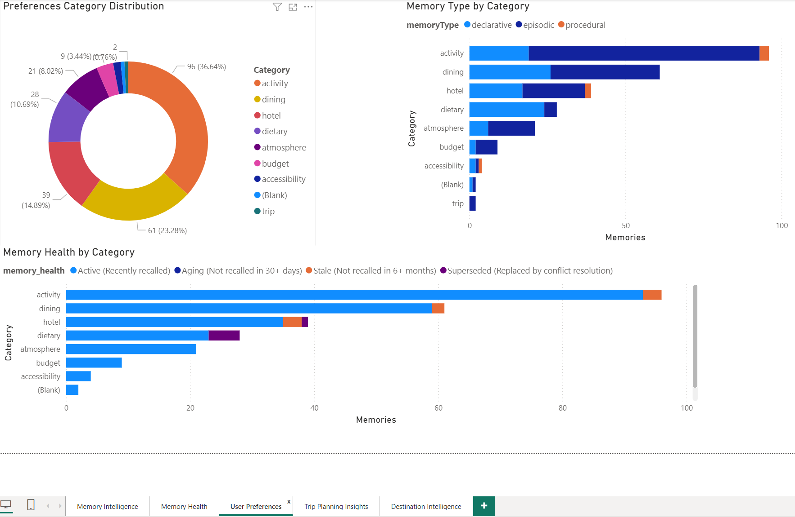

---

### Page 4: Trip Planning Insights

This page answers: **How is the AI planning trips?**

This page shifts from memory to action. The trip status donut shows the pipeline from planning through confirmed to completed. The trips by month donut reveals seasonal patterns in travel planning. The activity slot distribution shows how the AI structures each day's itinerary across morning, lunch, afternoon, dinner, and accommodation slots — a direct measure of itinerary completeness.

**Key insights to highlight:**

- The confirmed/planning/completed split shows the trip lifecycle
- Seasonal clustering reveals whether the generated personas have realistic travel timing
- Morning, lunch, afternoon, and dinner slots should be roughly equal; accommodation is one per trip, not per day

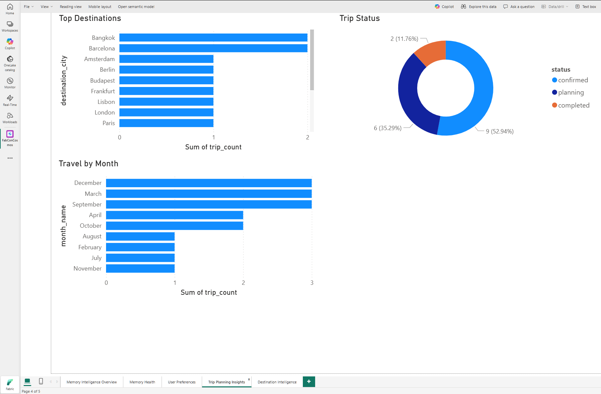

---

### Page 5: Destination Intelligence

This page answers: **Where does the AI send people, and what do those trips look like?**

This page focuses on the destinations themselves. The top destinations bar chart shows which cities the AI plans trips for most frequently. Trip duration by destination reveals which cities get longer immersive itineraries vs. quick getaways. Trip recommendations by city counts every individual activity slot the AI filled — cities with high recommendation counts relative to trip counts mean the AI is planning dense, activity-packed itineraries.

**Key insights to highlight:**

- Bangkok and Barcelona tend to dominate because multiple personas request them
- Most trips are 3-5 days, reflecting the typical city break pattern the personas requested
- A city with many recommendations relative to its trip count means dense itineraries

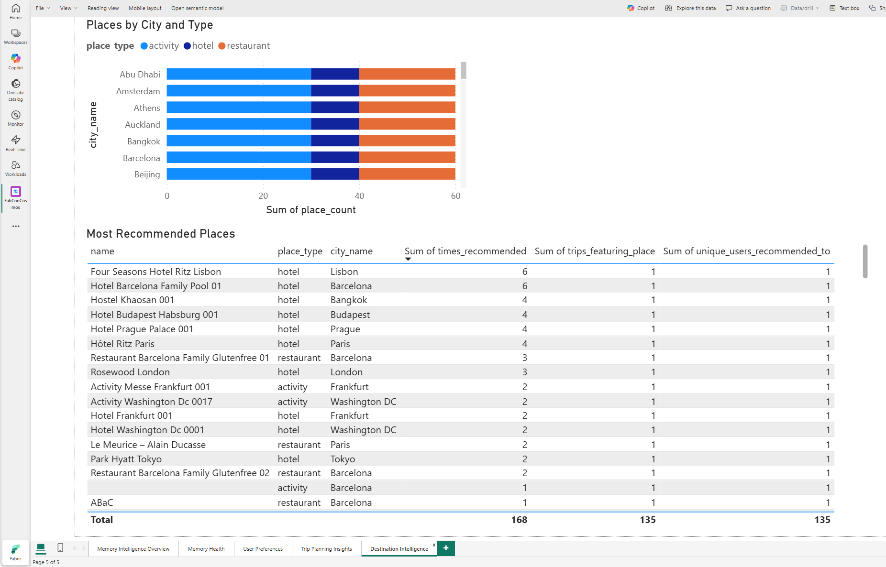

---

## Step 5: SQL Endpoint Queries (Optional)

The file `sql_endpoint_queries.sql` contains ready-to-run queries for the Fabric SQL Analytics Endpoint. These are useful for:

- Quick exploration of the mirrored data before running the notebook
- Power BI DirectQuery connections for simple flat-field analytics
- Debugging data quality issues

Open the SQL Analytics Endpoint in your Fabric workspace and paste queries from the file.

> **Limitation:** SQL queries cannot easily flatten deeply nested JSON arrays (e.g., Trips `days[]`). Use the Spark notebook for those transformations.

---

## File Reference

| File | Purpose |
|------|---------|
| `data_generator.py` | Generates 12 users with 10+ turn conversations, creates trips, and updates trip statuses |
| `data_enricher.py` | Adds preference-conflict conversations to trigger memory supersession (run after generator) |
| `rbac-mirror.ps1` | Configures Cosmos DB RBAC role for Fabric mirroring — PowerShell (Windows) |
| `rbac-mirror.sh` | Configures Cosmos DB RBAC role for Fabric mirroring — Bash (macOS/Linux) |
| `TravelAssistantNotebook.ipynb` | Fabric Spark notebook -- reads mirrored data, flattens JSON, writes analytical Delta tables |
| `sql_endpoint_queries.sql` | SQL queries for the Fabric SQL Analytics Endpoint (optional) |
| `TravelAssistantReport.pbit` | Power BI template — prompts for SQL endpoint on open |
| `PowerBI_Build_Guide.md` | Step-by-step guide for building the report from scratch |
| `.venv/` | Python virtual environment for the scripts (httpx) |
| `README.md` | This guide |
